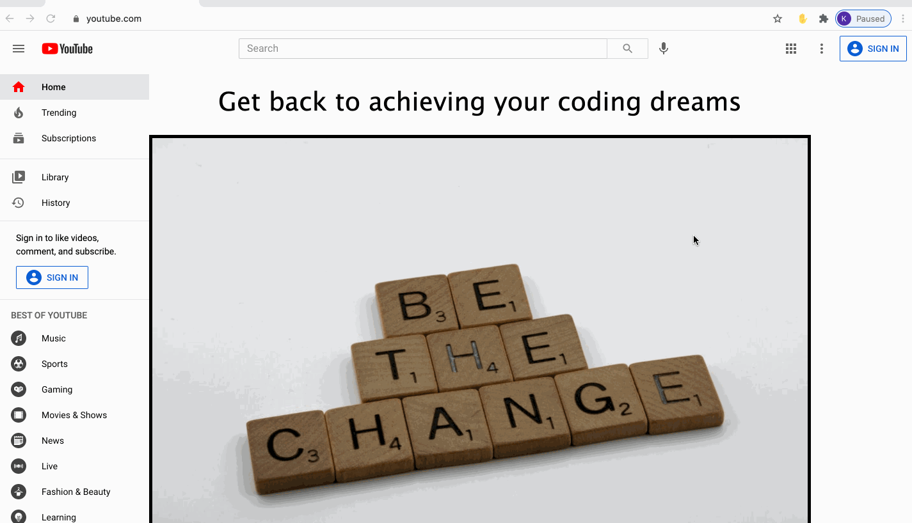

## Focus: Chrome Extension to help you achieve your coding dreams :hand:

This Chrome Extension showcases two key features:

1. When a user visit Youtube, she or he is blocked from watching any videos and instead is shown a motivational quote and a random image obtained via Unsplash API. Users can refuel their inspiration by accessing different images through clicking on the image or pressing a space bar.
2. When a user clicks on the _Ready, Set, Code!_ button in the extension pop-up window, a random coding practice website opens in a new tab to encourage additional practice. (I was not sponsored by any of the listed websites.)

---

### Demo

#### Extension in action on YouTube

---

#### Extension pop-up window

---

Thanks to Codesmith for providing a Chrome Extension guide as part of their [CSX](https://csx.codesmith.io/) course! :tada:
